# Preuve responsive web - issue #155

Statut : captures collectees le 2026-07-02 sur environnement local.

## Objectif

Prouver que l'interface web MyTuums reste exploitable sur desktop, tablette et mobile pour les parcours principaux du projet fil rouge : authentification, feed, creation de post, recherche/discover, profil, signalement et moderation.

## Environnement

| Element | Valeur |
| --- | --- |
| Issue | #155 |
| Responsable | AcryTeryx |
| Source applicative | `apps/web` |
| Environnement | Stack locale #152, donnees `smoke:setup`, compte utilisateur et compte staff |
| Dossier captures | `docs/fil-rouge/captures/issue-155/` |

## Couverture des criteres

| Critere #155 | Statut | Preuve |
| --- | --- | --- |
| Captures auth | Couvert | `desktop-auth.png`, `mobile-auth.png` |
| Captures feed | Couvert | `desktop-feed.png`, `tablet-feed.png`, `mobile-feed.png` |
| Captures post creation | Couvert | Composer visible sur `desktop-feed.png` et `tablet-feed.png` ; post cree visible sur `tablet-feed.png`. |
| Captures search/discover | Couvert | `desktop-discover.png`, `desktop-discover-filtered.png`, `tablet-discover.png`, `mobile-discover.png` |
| Captures profile | Couvert | `desktop-profile.png`, `tablet-profile.png`, `mobile-profile.png` |
| Captures moderation/reporting | Couvert | Signalement : `desktop-report.png`, `tablet-report.png`, `mobile-report.png` ; moderation staff : `desktop-admin.png`. |
| Desktop/tablette/mobile representes | Couvert | Captures desktop ~1900x1040, tablette ~1024x980, mobile ~426x930. |
| Defauts UX visibles fixes ou listes | Couvert | Aucun defaut responsive bloquant observe dans les captures fournies ; limites listees ci-dessous. |

## Registre des captures

| Viewport | Parcours | Fichier |
| --- | --- | --- |
| Desktop | Authentification | `captures/issue-155/desktop-auth.png` |
| Desktop | Feed et composer | `captures/issue-155/desktop-feed.png` |
| Desktop | Discover | `captures/issue-155/desktop-discover.png` |
| Desktop | Discover filtre | `captures/issue-155/desktop-discover-filtered.png` |
| Desktop | Profil | `captures/issue-155/desktop-profile.png` |
| Desktop | Signalement | `captures/issue-155/desktop-report.png` |
| Desktop | Moderation staff | `captures/issue-155/desktop-admin.png` |
| Tablette | Feed et composer | `captures/issue-155/tablet-feed.png` |
| Tablette | Discover | `captures/issue-155/tablet-discover.png` |
| Tablette | Profil | `captures/issue-155/tablet-profile.png` |
| Tablette | Signalement | `captures/issue-155/tablet-report.png` |
| Mobile | Authentification | `captures/issue-155/mobile-auth.png` |
| Mobile | Feed | `captures/issue-155/mobile-feed.png` |
| Mobile | Discover | `captures/issue-155/mobile-discover.png` |
| Mobile | Profil | `captures/issue-155/mobile-profile.png` |
| Mobile | Signalement | `captures/issue-155/mobile-report.png` |

## Captures desktop

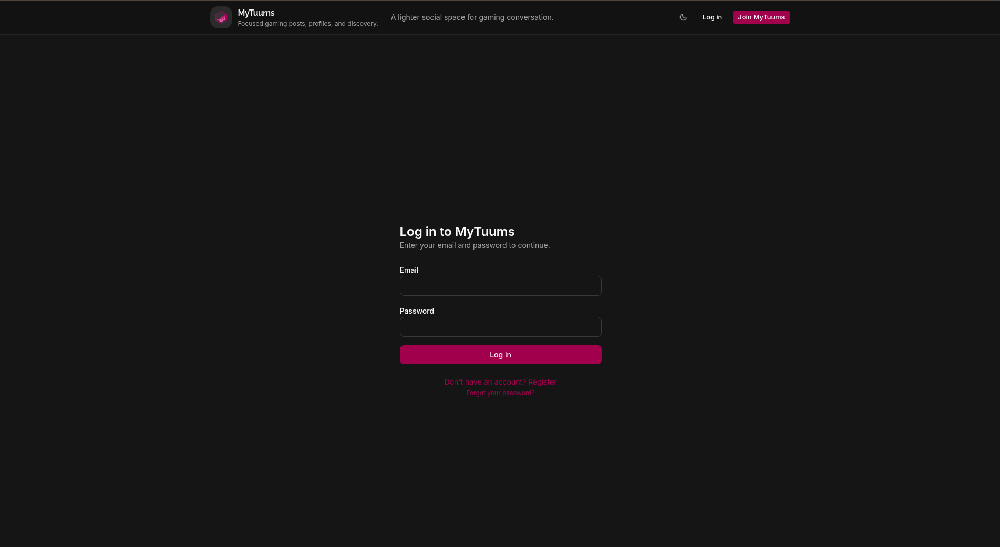

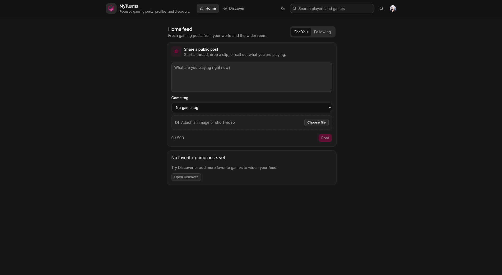

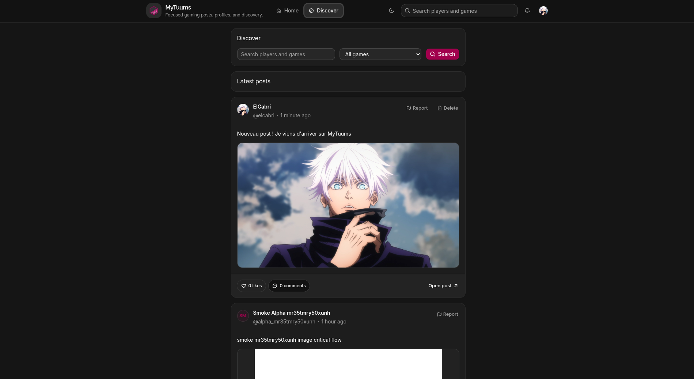

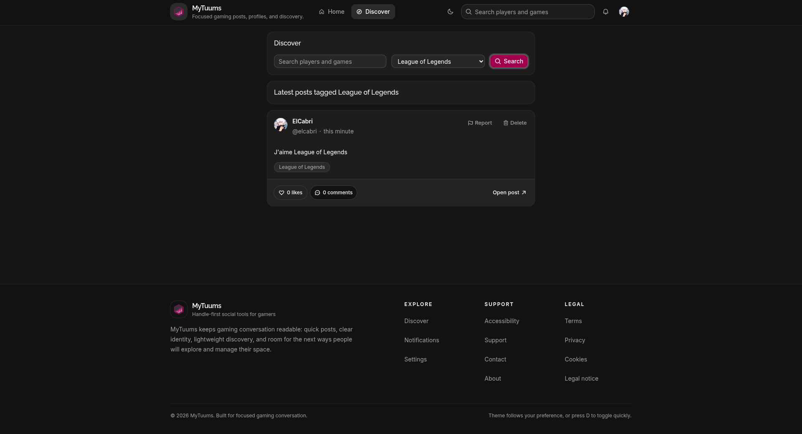

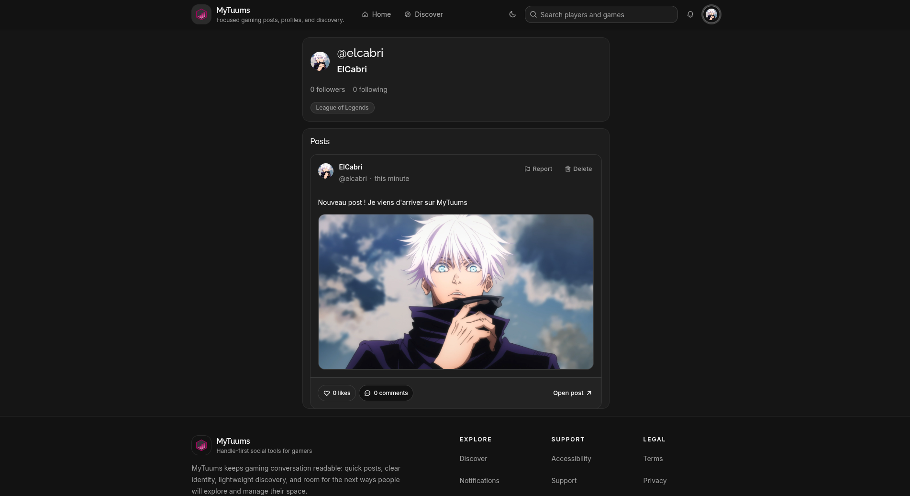

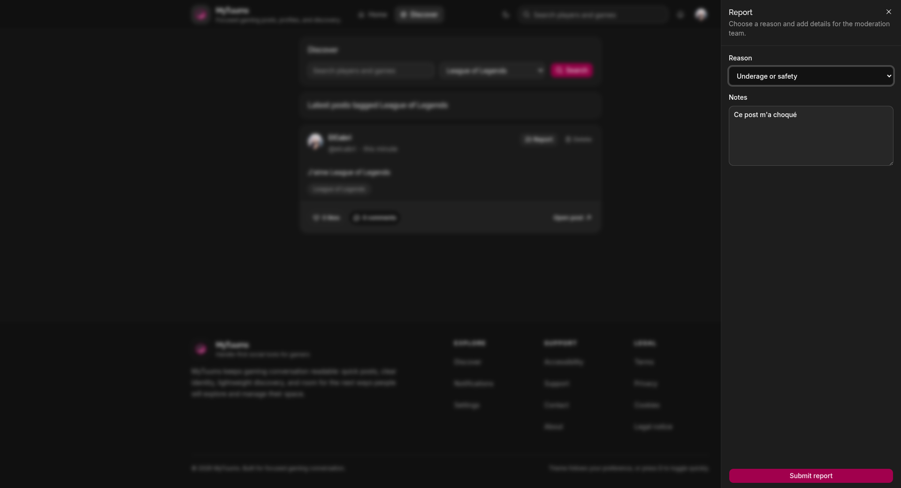

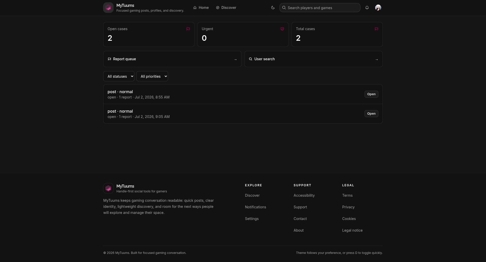

## Captures tablette

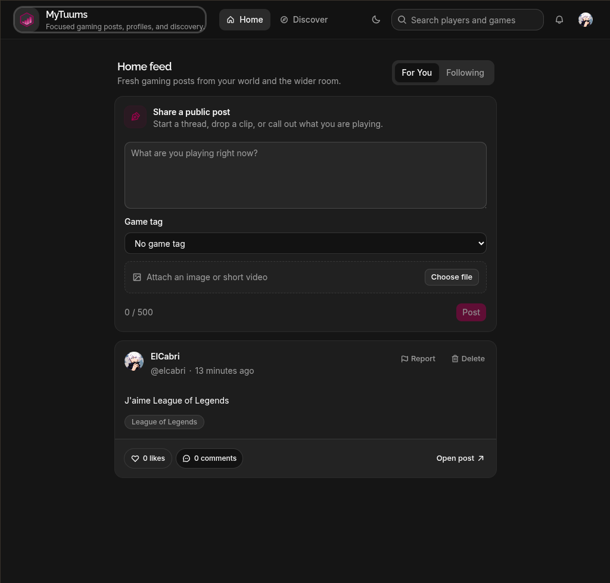

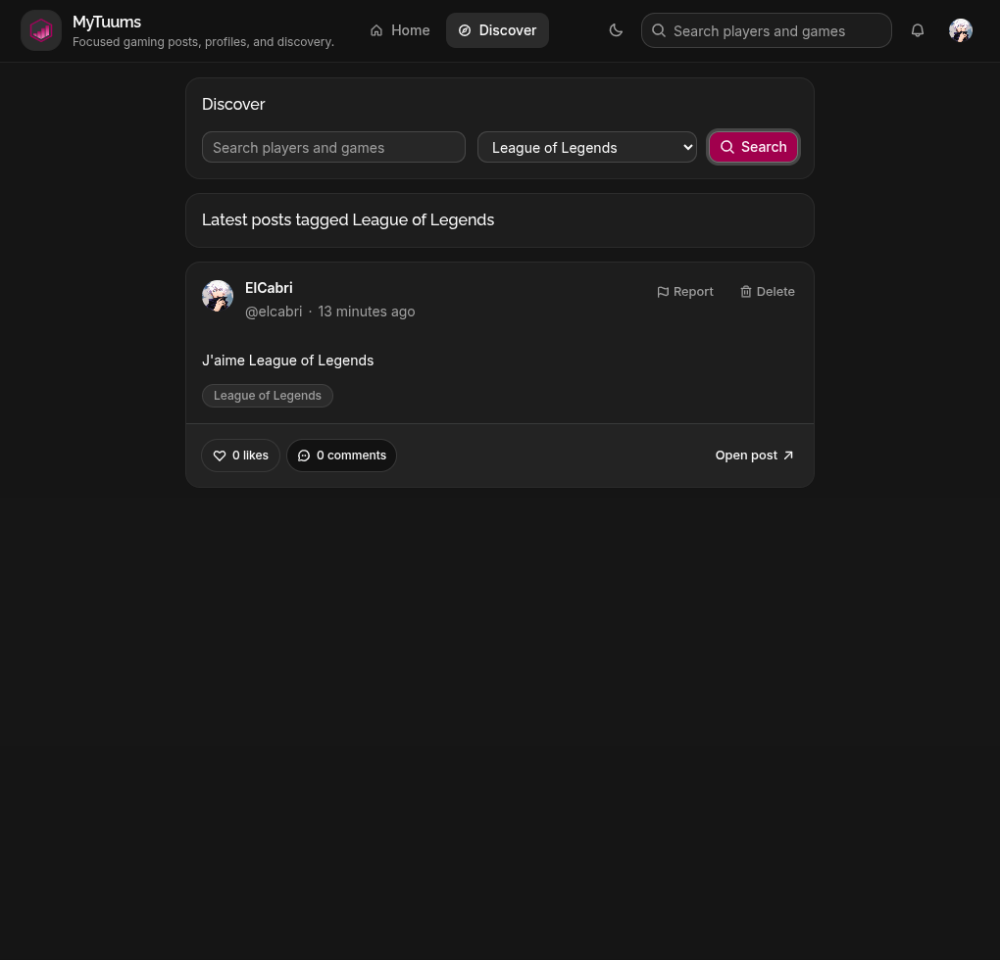

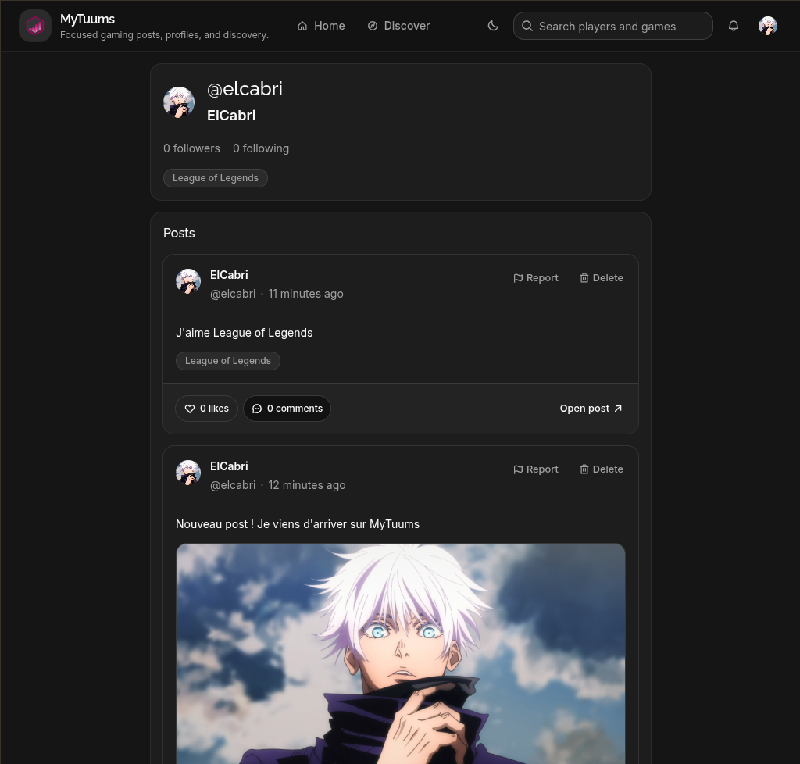

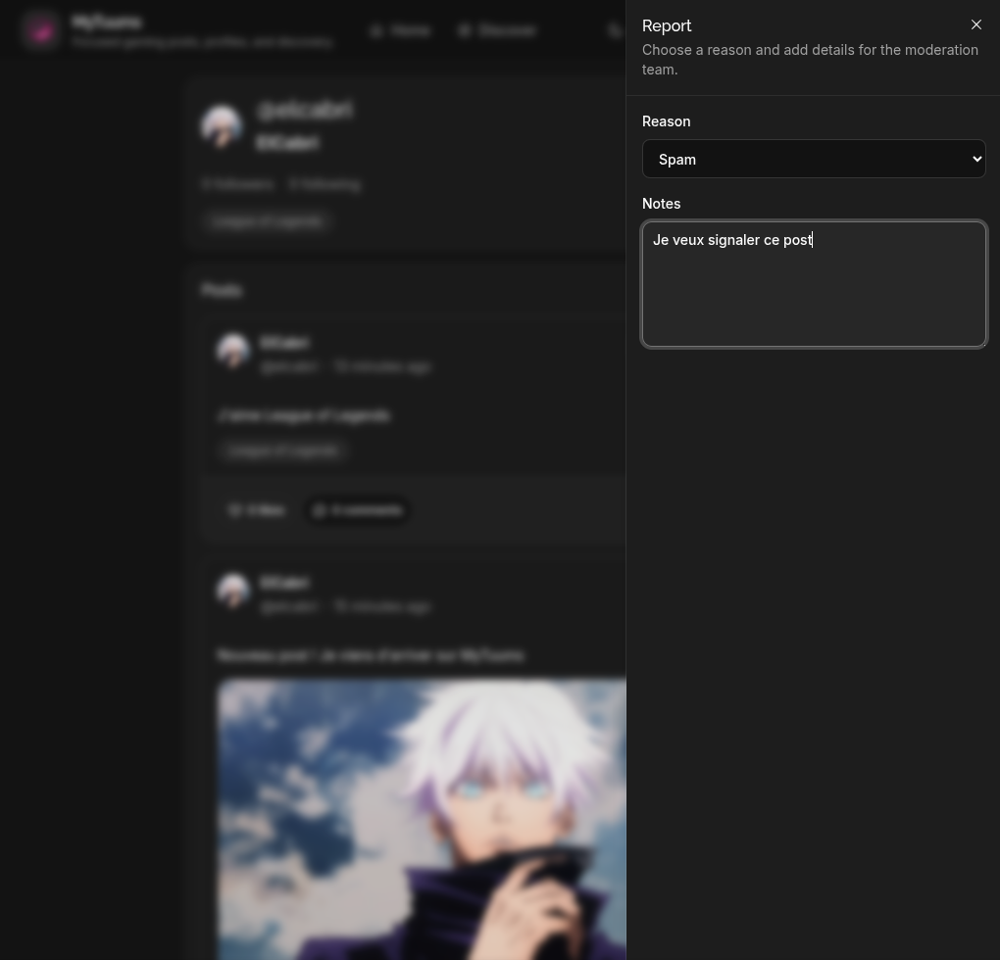

## Captures mobile

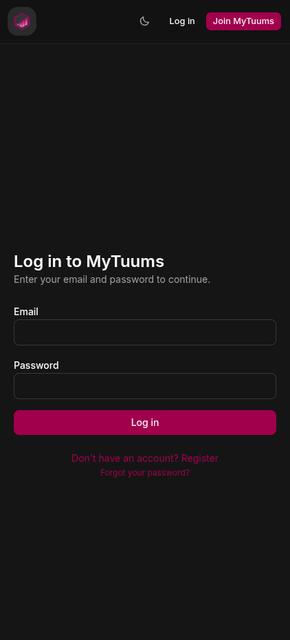

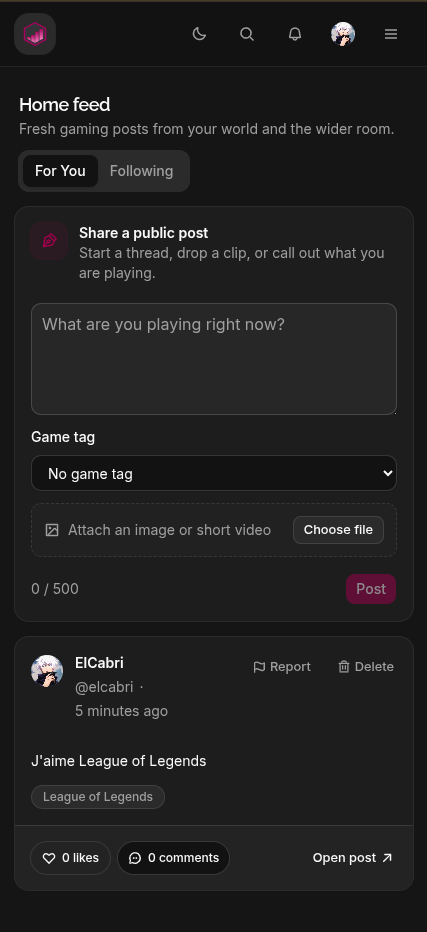

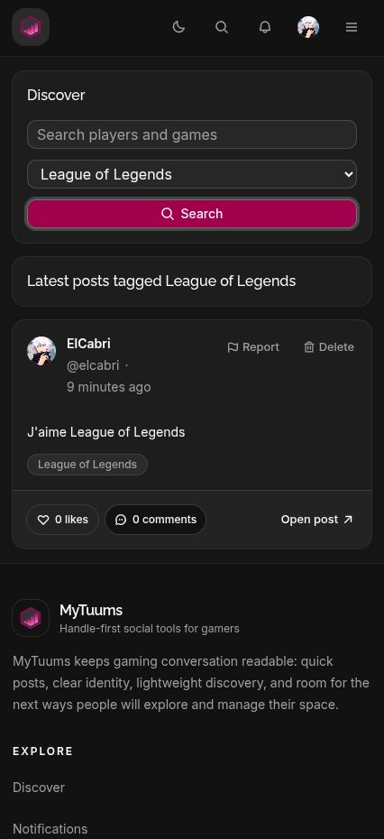

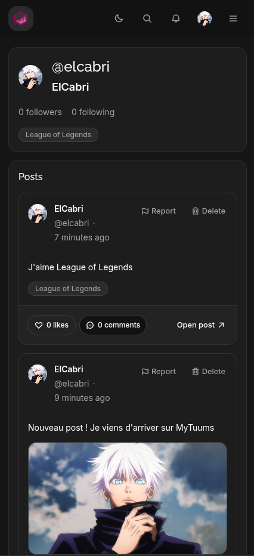

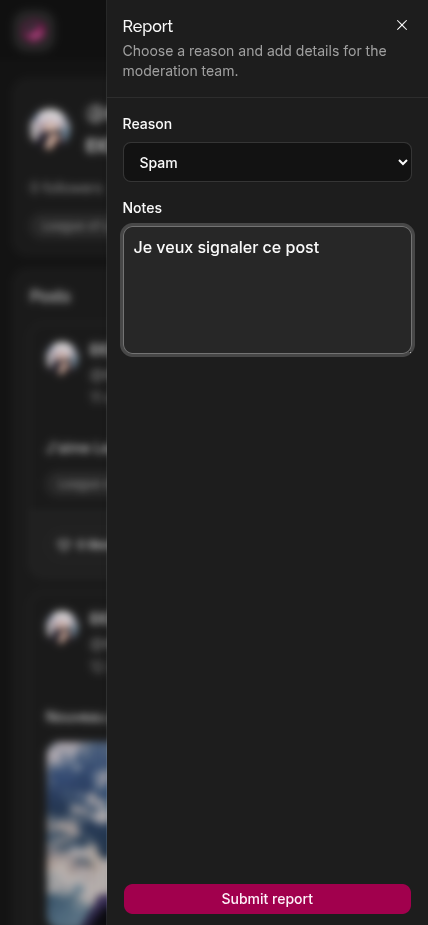

## Limites documentees

- La moderation staff est capturee sur desktop uniquement. C'est coherent avec son usage back-office ; le signalement utilisateur est en revanche capture sur desktop, tablette et mobile.
- Les captures tablette et mobile priorisent les parcours utilisateur finaux : feed, discover, profil et report.
- Cette preuve ne remplace pas l'audit accessibilite/performance de #156. Elle valide le rendu responsive observable, pas le score Axe ou Lighthouse.

## Conclusion

Les criteres de #155 sont couverts : les captures representent desktop, tablette et mobile, les parcours principaux sont documentes, le reporting et la moderation sont visibles, et aucune anomalie responsive bloquante n'est identifiee dans les etats captures.
