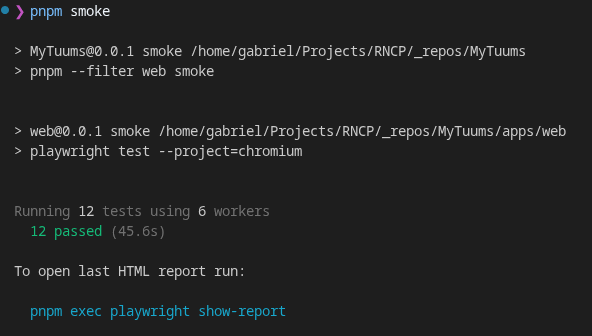
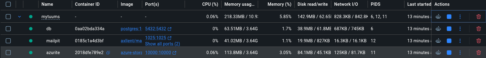
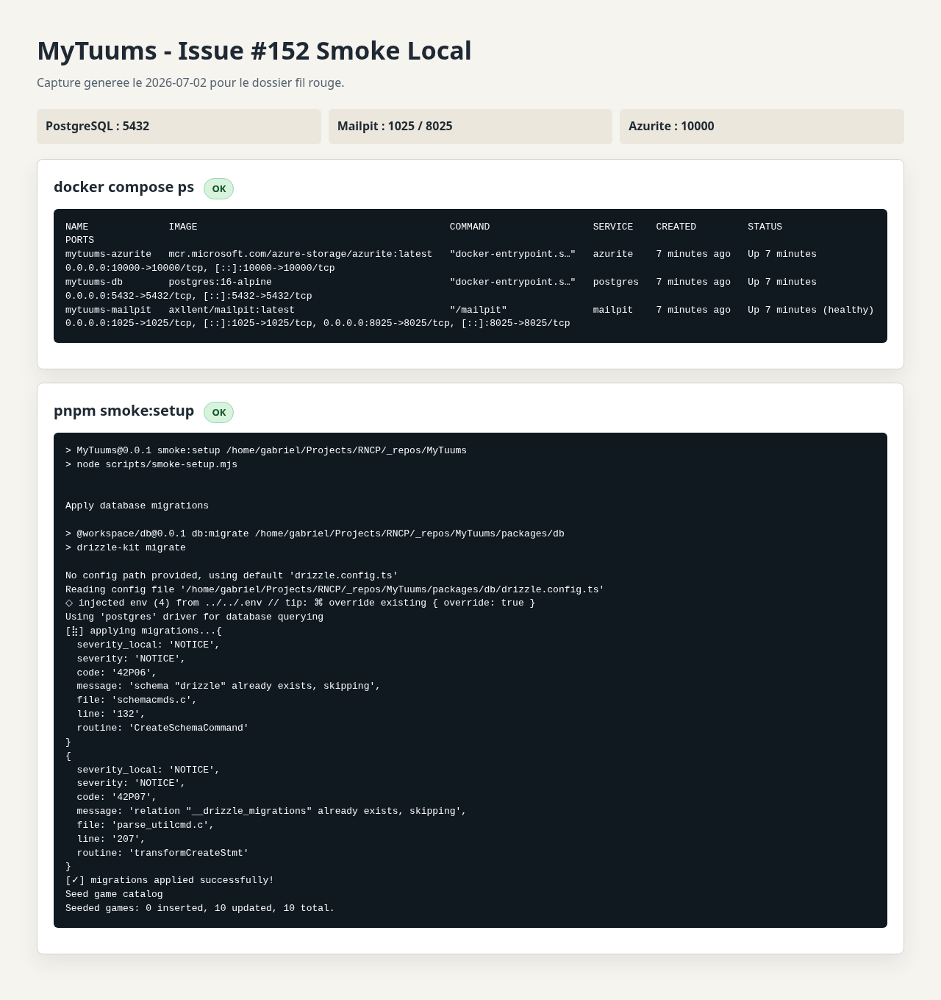
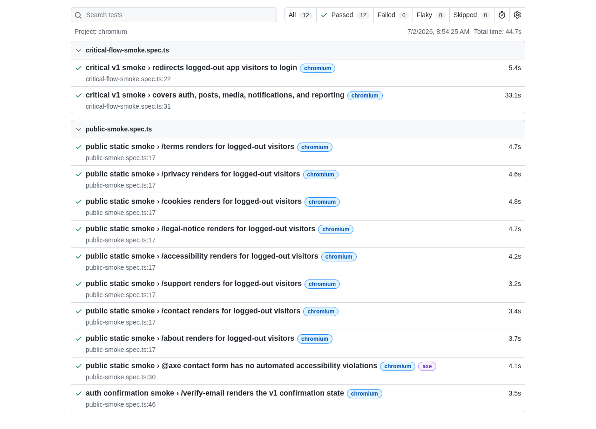

# Preuve smoke local - issue #152

Statut : valide localement le 2026-07-02 a 08:55 CEST, sur le commit `b29d57f`.

## Objectif

Prouver que le chemin de validation local est reproductible avec Docker, migrations, seeds, demarrage web/API via Playwright, et smoke end-to-end.

## Environnement

| Element | Valeur |
| --- | --- |
| Branche | `codex/issue-152-smoke-evidence` |
| Commit de base | `b29d57f` |
| Package manager | `pnpm 9.15.9` |
| Infra Docker | PostgreSQL 16, Mailpit, Azurite |
| Smoke browser | Playwright Chromium |

## Commandes executees

| Commande | Resultat | Preuve utile |
| --- | --- | --- |
| `CI=true pnpm install --frozen-lockfile` | OK | Lockfile a jour, 1100 packages installes. |
| `pnpm infra` | OK | Containers `mytuums-db`, `mytuums-mailpit`, `mytuums-azurite` demarres. |
| `docker compose ps` | OK | Postgres expose `5432`, Mailpit expose `1025/8025`, Azurite expose `10000`. |
| `pnpm smoke:setup` | OK | Migrations appliquees ; catalogue jeux seede : 10 inserted, 0 updated, 10 total. |
| `pnpm smoke` | OK apres installation Chromium | `12 passed (44.7s)`. |

## Captures d'ecran

Les captures manuelles suivantes constituent la preuve visuelle principale pour le dossier oral.



Cette capture montre le terminal apres `pnpm smoke` avec `12 passed`.



Cette capture montre Docker Desktop avec les services `db`, `mailpit` et `azurite` actifs.

Les captures automatiques suivantes restent en complement pour garder une preuve lisible du detail `smoke:setup` et du rapport Playwright.



Cette capture montre les services Docker actifs et un rerun idempotent de `pnpm smoke:setup`. Le premier passage a insere 10 jeux ; le rerun affiche logiquement `0 inserted, 10 updated, 10 total`.



Cette capture montre le rapport Playwright avec 12 tests passes, 0 failed, sur le projet Chromium.

## Caveat de setup

Le premier `pnpm smoke` a echoue avant execution fonctionnelle parce que le cache navigateur Playwright ne contenait pas `chromium_headless_shell-1223`.

Resolution appliquee :

```bash
pnpm --filter web exec playwright install chromium
```

Apres installation, le smoke a ete relance sans changer le code applicatif et a passe.

## Couverture fonctionnelle du smoke

Le smoke Playwright couvre :

- redirection visiteur non connecte vers login ;
- inscription de deux utilisateurs dynamiques ;
- verification email via Mailpit ;
- onboarding profil ;
- login ;
- creation de post texte ;
- upload image via le flux media local/Azurite ;
- detail de post ;
- like ;
- report ;
- notification de like.

Source : `apps/web/tests/e2e/critical-flow-smoke.spec.ts`.

## Donnees et services confirmes

| Besoin demo | Statut #152 | Note |
| --- | --- | --- |
| Utilisateur principal | Valide | Cree dynamiquement par Playwright. |
| Deuxieme utilisateur | Valide | Cree dynamiquement par Playwright. |
| Jeux seedes | Valide | `smoke:setup` seed 10 jeux. |
| Email local | Valide | Mailpit utilise pour la verification email. |
| Blob local | Valide | Post image visible apres upload. |
| Compte staff | Hors perimetre #152 | A preparer manuellement pour la demo moderation/admin. |

## Artefacts locaux

Playwright a genere des artefacts locaux ignores par Git :

- `apps/web/test-results/.last-run.json`
- `apps/web/playwright-report/index.html`

Ces fichiers peuvent etre ouverts localement pour verifier le dernier run, mais la preuve durable pour le dossier est le resume ci-dessus.

## Conclusion

Les criteres de #152 sont couverts : `pnpm infra`, `pnpm smoke:setup` et `pnpm smoke` passent localement ; le caveat Playwright est documente ; les services et donnees necessaires au parcours smoke sont identifies.
