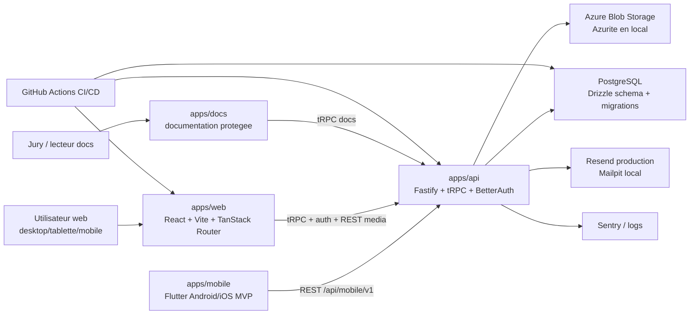
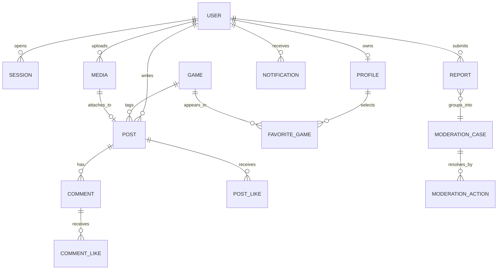

# Architecture technique fil rouge

Statut : version de travail du 2026-07-01.

Objectif : fournir une lecture technique autonome pour le jury UF DEV B3 :
architecture web/API/mobile/database/storage/email, modele de donnees simplifie
et controles de securite relies au code.

## Vue d'ensemble

La ligne Flutter est limitee a un MVP Android/iOS cible : elle ne remplace pas le
web responsive, mais elle couvre les parcours mobiles essentiels via une facade
REST versionnee sous `/api/mobile/v1`.

## Composants

| Composant | Role | Preuves |
| --- | --- | --- |
| `apps/web` | Interface produit responsive, routes publiques, auth, feed, post, search, profile, moderation/report | Routes sous `apps/web/src/routes`, smoke Playwright |
| `apps/api` | Host Fastify, tRPC, auth, health, uploads, services metier | `apps/api/src/routers`, `apps/api/src/services` |
| `packages/db` | Schema Drizzle, migrations, client PostgreSQL | `packages/db/src/schema.ts`, `packages/db/migrations` |
| `packages/types` | Value objects et constantes partagees | `packages/types/src` |
| `packages/ui` | Primitives ShadCN et wrappers UI | `packages/ui/src/components` |
| Azure Blob / Azurite | Stockage media prive avec URLs signees | media service, docker-compose |
| Resend / Mailpit | Emails transactionnels et validation locale | email service, smoke Mailpit |
| `apps/mobile` | MVP Flutter Android/iOS : auth, onboarding, feed, search, composer, profil, report | `apps/mobile/lib`, `apps/mobile/test`, facade `apps/api/src/mobile-routes.ts` |
| `/api/mobile/v1` | API REST stable pour le client Flutter | `apps/api/src/mobile-routes.ts`, `docs/adr/0004-mobile-rest-facade-before-orpc.md` |

## Routeurs API

| Routeur | Responsabilite |
| --- | --- |
| `profileRouter` | onboarding, profils, favoris, recherche profil |
| `postRouter` | creation, feed, detail, visibility |
| `mediaRouter` | upload URL, confirmation, media profiles/posts |
| `engagementRouter` | likes, follows, interactions sociales |
| `moderationRouter` | reports, cases, actions staff |
| `notificationRouter` | unread count et notifications |
| `gameRouter` | catalogue jeux, recherche, seed |
| `settingsRouter` | preferences, compte, suppression |
| `staffRouter` | roles, administration, audit |
| `contactRouter` | support/contact public |
| `docsRouter` | lecture docs pour l'app documentation |

## Modele de donnees simplifie

| Zone | Tables principales | Intention jury |
| --- | --- | --- |
| Auth et compte | `user`, `session`, `account`, `verification`, `account_deletion_hold` | Connexion, email/password, sessions, cycle de vie compte |
| Profil social | `profile`, `follow`, `block`, `favorite_game`, `user_preference` | Identite publique, relations, preferences |
| Contenu | `post`, `comment`, `post_like`, `comment_like`, `game` | Publication, discussion, decouverte par jeu |
| Media | `media`, `profile_media_replacement` | Upload, attachement, remplacement avatar/banner |
| Moderation | `report`, `moderation_case`, `moderation_action`, `role_change_audit` | Signalements, decisions staff, audit |
| Operations | `rate_limit`, `notification`, `contact_submission` | Anti-abus, notifications, support |

## Controles de securite relies au code

| Risque | Controle | Implementation |
| --- | --- | --- |
| Sessions volees ou invalides | cookies httpOnly, BetterAuth, verification session | `apps/api/src/auth`, `apps/api/src/context.ts` |
| Brute force auth | rate limit login/register/reset | `apps/api/src/auth/rate-limit.ts`, `rate_limit` |
| Acces staff abusif | roles owner/admin/moderator et policies | `apps/api/src/services/staff`, `authorization` |
| Upload dangereux ou couteux | limites MIME/taille, ownership, expiration | `apps/api/src/services/media` |
| Fuite media | blob prive, signed URLs, visibility parent | media service + visibility policy |
| CORS trop ouvert | origins explicites | `apps/api/src/cors-origins.ts` |
| Injection DB | Drizzle, parametres SQL, validations API | adapters DB, value objects |
| Donnees supprimees | account deletion hold et retention | account deletion service |
| Regression | typecheck, lint, tests, build, smoke, axe | `.github/workflows/ci.yml` |

## Captures utiles

- Diagramme architecture exporte depuis ce document.
- Extrait du schema Drizzle ou diagramme DB simplifie.
- Terminal `pnpm db:check` ou migration appliquee.
- Ecran GitHub Actions CI montrant typecheck/lint/build/tests/smoke/axe.
- Pour la partie Flutter : capture de `apps/mobile`, terminal `flutter analyze`
  / `flutter test`, puis emulateur Android/iOS sur login, feed, composer et
  report.
